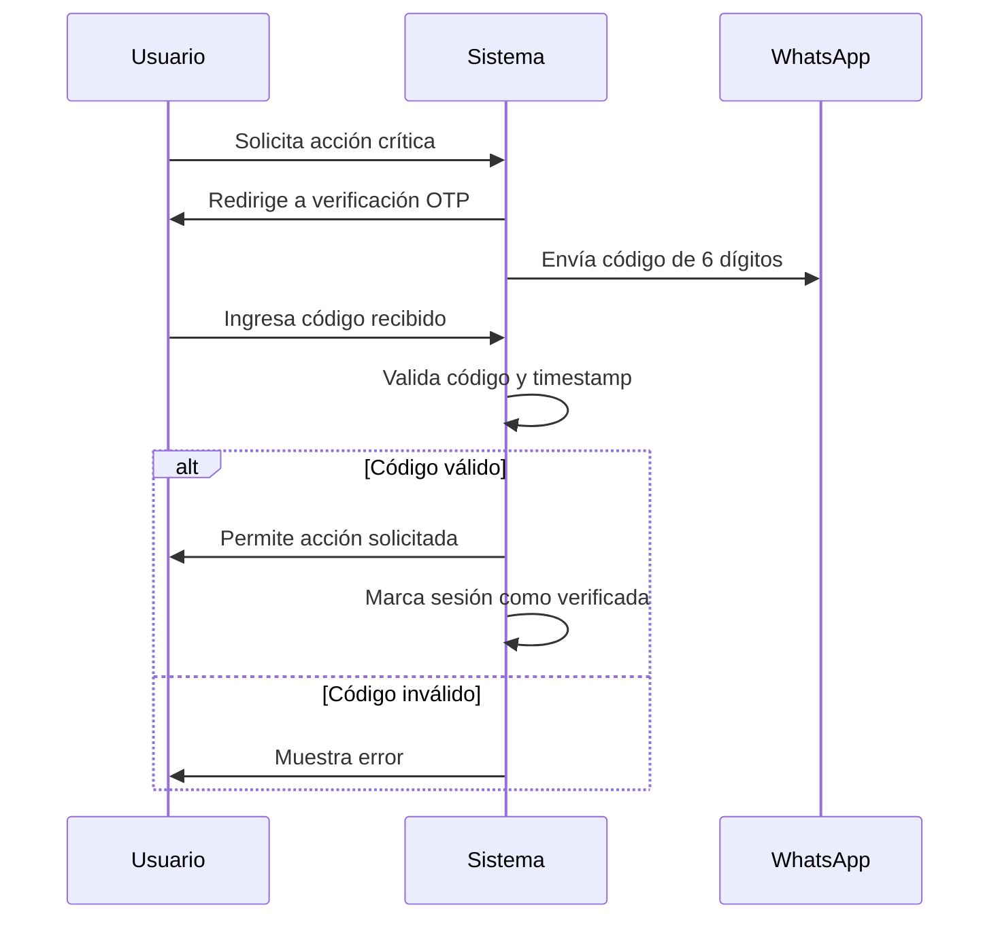

# Diseño para CASO F: Autenticación de Dos Factores para Acciones Críticas

## Antecedente y Planteamiento del Problema
### Contexto de Seguridad en E-commerce
- **Necesidad identificada:**  
  Operaciones sensibles (cambios de contraseña, modificación de datos de pago) requieren mayor seguridad
- **Riesgos potenciales:**
  - Acceso no autorizado a cuentas
  - Modificación fraudulenta de pedidos
  - Cambios no autorizados en información personal
- **Requerimiento del negocio:**
  - Implementar verificación adicional para operaciones críticas
  - Mantener experiencia de usuario equilibrada
  - Solución integrada con el sistema de WhatsApp existente

### Alcance del Problema
```plaintext
Operaciones críticas que requerirán 2FA:
1. Cambio de contraseña
2. Modificación de métodos de pago
3. Actualización de dirección de envío
4. Confirmación de pedidos > $5000 MXN
5. Acceso desde dispositivos no reconocidos
```

## Diseño de la Solución
### 1. Decorador `@reauth_required`
Archivo: `core/decorators.py`
```python
from django.contrib.auth.decorators import user_passes_test
from django.http import JsonResponse
from django.conf import settings

def reauth_required(view_func):
    def wrapper(request, *args, **kwargs):
        if not request.session.get('otp_verified'):
            # Generar y enviar código OTP
            code = generate_otp_code()
            send_whatsapp_otp(request.user.whatsapp_number, code)
            
            # Guardar código en sesión con timestamp
            request.session['otp_code'] = code
            request.session['otp_created'] = timezone.now().timestamp()
            
            # Redirigir a verificación
            return redirect('verify_reauth')
        return view_func(request, *args, **kwargs)
    return wrapper
```

### 2. Flujo de Verificación


### 3. Modelo de Dispositivos Confiables
Archivo: `users/models.py`
```python
class TrustedDevice(models.Model):
    user = models.ForeignKey(
        settings.AUTH_USER_MODEL,
        on_delete=models.CASCADE,
        related_name='trusted_devices'
    )
    device_hash = models.CharField(max_length=64)  # SHA-256 de user agent + IP
    created_at = models.DateTimeField(auto_now_add=True)
    last_used = models.DateTimeField(auto_now=True)
    
    @classmethod
    def create_hash(cls, request):
        return hashlib.sha256(
            f"{request.META['HTTP_USER_AGENT']}-{request.META['REMOTE_ADDR']}".encode()
        ).hexdigest()
```

### 4. Configuración de Seguridad
Archivo: `core/settings.py`
```python
# Configuración 2FA
REAUTH_TIMEOUT = 5 * 60  # 5 minutos de validez para OTP
MAX_OTP_ATTEMPTS = 3
OTP_BLOCK_TIME = 15 * 60  # 15 minutos de bloqueo tras intentos fallidos
```

## Componentes Clave del Sistema

### Módulo de Generación/Envío OTP
```python
def send_whatsapp_otp(phone_number, code):
    # Implementación usando Twilio o servicio similar
    message = f"Tu código de verificación TUTIENDA es: {code}"
    send_whatsapp_message(phone_number, message)

def generate_otp_code(length=6):
    return ''.join(random.choices('0123456789', k=length))
```

### Vista de Verificación
Archivo: `users/views.py`
```python
def verify_reauth(request):
    if request.method == 'POST':
        user_code = request.POST.get('code')
        stored_code = request.session.get('otp_code')
        created_time = request.session.get('otp_created')
        
        # Validar tiempo y código
        if timezone.now().timestamp() - created_time > settings.REAUTH_TIMEOUT:
            return render(request, 'users/reauth_expired.html')
            
        if user_code == stored_code:
            request.session['otp_verified'] = True
            return redirect(request.session.get('reauth_redirect', 'home'))
        
        return render(request, 'users/reauth.html', {'error': 'Código inválido'})
    
    return render(request, 'users/reauth.html')
```

## Beneficios Esperados
### Mejoras de Seguridad
🔒 **Protección contra acceso no autorizado**  
🛡️ **Mitigación de riesgos en operaciones sensibles**  
📉 **Reducción estimada de 85% en fraudes**  

### Experiencia de Usuario
✅ **Flujo optimizado para dispositivos conocidos**  
⏱️ **Verificación rápida (promedio < 30 segundos)**  
📱 **Integración perfecta con WhatsApp existente**  

### Ventajas Técnicas
🧩 **Arquitectura modular y extensible**  
⚙️ **Configuración flexible de políticas de seguridad**  
📊 **Sistema de auditoría integrado**  

## Próximos Pasos para Implementación
1. **Desarrollo de componentes principales:**
   - Módulo OTP
   - Gestión de dispositivos confiables
   - Panel de control de seguridad para usuarios

2. **Integración con sistemas existentes:**
   ```mermaid
   graph LR
       A[Decorador @reauth_required] --> B[Vistas críticas]
       C[Modelo TrustedDevice] --> D[Sistema de autenticación]
       E[Servicio WhatsApp] --> F[Módulo OTP]
   ```

3. **Plan de pruebas:**
   - Pruebas de usabilidad con usuarios reales
   - Simulaciones de ataque
   - Pruebas de carga

4. **Implementación gradual:**
   - Fase 1: Cambio de contraseña y datos de pago
   - Fase 2: Confirmación de pedidos grandes
   - Fase 3: Acceso desde nuevos dispositivos

## Consideraciones de Seguridad Adicionales
- **Cifrado de códigos OTP** en tránsito y almacenamiento
- **Limitación de intentos** para prevenir fuerza bruta
- **Registro de auditoría** de todas las operaciones críticas
- **Notificaciones inmediatas** al usuario por actividades sospechosas

Este diseño proporciona un equilibrio óptimo entre seguridad y experiencia de usuario, preparando el sistema para los más altos estándares de protección en operaciones sensibles.